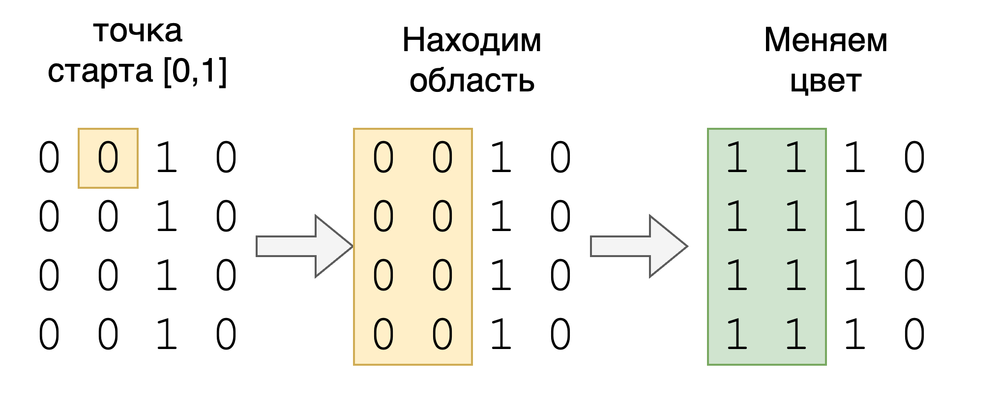

# ДЗ 
Требуется реализовать методы в `RandomizedAlgorithms.java`, и проверить их тестами `MatrixTest.java`

Запуск тестов: 
*Кнопкой в IntelliJ*


* Или командой `mvn -Dtest=MatrixTest test` в терминале

## 1. Раскрашивание матрицы

★★★☆☆

Дана двухцветная матрица, состоящая из 0 и 1, а также произвольная
точка с координатами [row, col]. Метод должен изменить все ячейки области в
которой находится точка на значение newColor.

```java
int[][] paint(int[][] image, int row, int col, int newColor)
```

Например, для матрицы:

```java
image = [[0, 0, 1, 0],
         [0, 0, 1, 0],
         [0, 0, 1, 0],
         [0, 0, 1, 0]]
row = 0
col = 1
newColor = 1
```

надо закрасить область из 0, прилегающей к начальной точки (0, 1) единицами. Тогда результат 
окрашивания будет выглядить так:<br/>

```java
image = [[1, 1, 1, 0],
         [1, 1, 1, 0],
         [1, 1, 1, 0],
         [1, 1, 1, 0]]
```

Пример пошагово:



## 2. Острова

★★★★☆

Для двумерного массива размером MxN, состоящего из единиц, которые обозначают сушу, и нулей, 
обозначающих воду. Верните количество островов.

Остров окружён водой и образован соединением соседних земель по горизонтали и вертикали. Вы 
можете предположить, что все четыре края матрицы окружены водой.

```java
int numIslands(char[][] grid)
```
