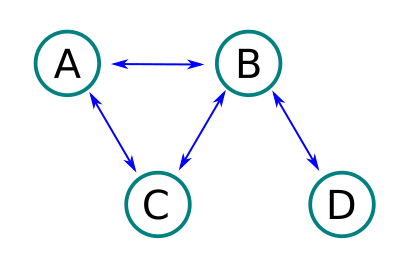
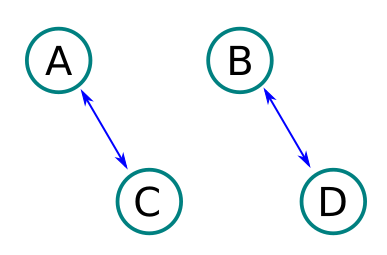
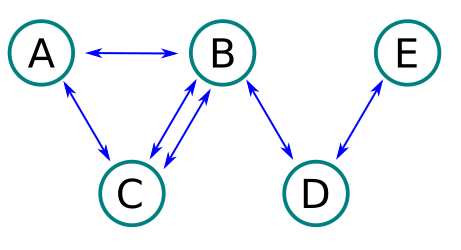

# ДЗ

Требуется реализовать методы в классах
`Bridges.java`, `Path.java` и проверить их тестами `BridgesTest.java` и `PathTest.java`

Запуск тестов:

*Кнопкой в IntelliJ*


## 1. Острова и мосты

★★★☆☆

> Запуск теста в терминале командой `mvn -Dtest="BridgesTest" test` 

Мы попали на планету Островное государство. И правительство задумалось об организации сообщений между островами.
Министерство транспорта решило не утруждать себя и объявило конкурс на создание проекта соединения островов мостами
среди жителей. Поступило множество различных предложений и для автоматизации проверки проектов на соответствие
требованиям поручили вам проверить каждый проект и дать оценку, принимать проект к рассмотрению или отказать.

Требования к подходящим проектам достаточно просты:

- количество островов более 1
- количество мостов более 1
- для посещения всех островов необходимо пройти по каждому мосту только один раз
- посещать один и тот же остров можно неограниченное количество раз
- начинать путешествие возможно с любого острова

Проверка производится методом:

```java
public static boolean isProjectSuccess(Map<String, List<String>>project)
```

Министерство приложило пример некоторых проектов:

**Проект 1**

Входные данные:


```
A: B,C
B: A,C
C: A,B
```

Возвращает **true**

**Проект 2**

Входные данные:



```
A: B,C
B: A,C,D
C: A,B
D: B
```

Возвращает **true**

**Проект 3**

Входные данные:



```
A: C
B: D
C: A
D: B
```

Возвращает **false**

**Проект 4**

Входные данные:



```
A: C,B
B: A,C,C,D
C: A,B,B
D: B,E
E: D
```

Возвращает **true**

## 2. Сказочное путешествие

★★★★☆

> Запуск теста в терминале командой `mvn -Dtest="PathTest" test`

Однажды вышли братья на широкий отцовский двор, натянули свои тугие луки и выстрелили.

Старшие братья как пошли искать свои стрелы, сразу их нашли: один — в боярском тереме, другой — на купеческом дворе. А
Иван-царевич долго не может найти свою стрелу, которая упала в топкое болото.

Поможем ему в этом, найдем кратчайший путь с учетом особенности местности, используя карту:

```
🏠🌷🌊🌊🌷🌷🌳
🌷🌷🌊🌊🌷🌷🌷
🌷🌷🌋🌳🌳🌳🌷
🌋🌋🌋🌳🌳🌷🌷
🌋🌳🌳🌋🌷🌷🐸
```

Иван-царевич всегда начинает путешествие из левого верхнего квадрата и должен попасть в нижний правый. Необходимо найти
самый короткий путь и вернуть в результате выполнения метода, количество часов требуемой для преодоления маршрута.

Для прохождения каждого типа местности Иван затрачивает разное количество времени:

| Местность | Время   |
|-----------|---------|
| 🌷 Поле   | 1 час   |
| 🌳 Лес    | 2 часа  |
| 🌊 Озеро  | 5 часов |
| 🌋 Гора   | 8 часов |

Для примера выше, самый оптимальный путь будет следующим:

```
🏠🌷🌊🌊🌷🌷⬜
⬜⬜⬜⬜⬜🌷🌷
⬜⬜⬜⬜⬜⬜🌷
⬜⬜⬜⬜⬜⬜🌷
⬜⬜⬜⬜⬜⬜🐸
```

И он займет 7 (7×1) часов по полям и 10 (5×2) часов по озерам. В сумме 17 часов.

В примере выше это не единственный путь, который проходится за 17 часов. Но нам не так важен путь сам маршрут, а важно
только затраченное время. Для расчета реализуйте метод:

```java
public static int shortestPathDuration(int[][] map){}
```

Для более простой работы с картой, она представлена в виде двумерного массив, 
в ячейках указано время за которое проходится местность. Например, карта из примера будет выглядеть так:

```
0,1,5,5,1,1,2
1,1,5,5,1,1,1
1,1,8,2,2,2,1
8,8,8,2,2,1,1
8,2,2,8,1,1,0
```

А скольки героям такая программа поможем совершить свои героические поступки! Переоценить полезность крайне сложно!
Успехов в решении!
